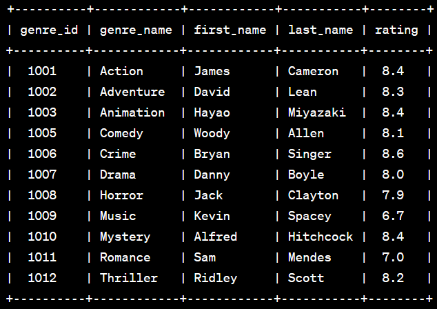
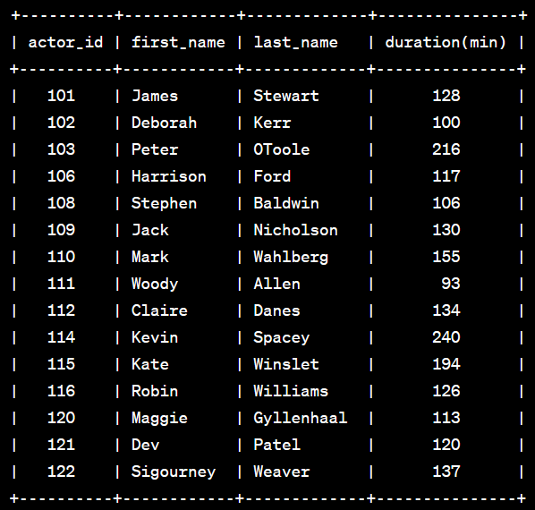
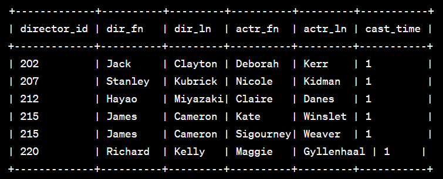

# SQL Assignment
## Requirement
- ใน SQL script ได้มีการใช้งาน window function ดังนั้นจึงต้องรันบน engine ที่รองรับ window function
- script ถูกเขียนด้วย syntax ของ MySQL ดังนั้นจึงต้องใช้ compiler ที่สามารถอ่าน syntax แบบ MySQL ได้
- ตัว script ในข้อ 4 มีการคำสั่ง update ที่ทำการ update ทั้ง column โดยไม่มีเงื่อนไข where จึงจำเป็นที่จะต้องปิดใช้งาน soft update ก่อนจึงจะสามารถทำงานได้
## How to execute program
1. สร้าง view ***movie_base_query*** จาก file **movie_base_query.sql** 
2. run ไฟล์ ***SQL-Qusetion*** ตามข้อที่ต้องการเช่น หากต้องการดูผลลัพธ์ในข้อ 1 ให้ run ไฟล์ ***SQL-Question1.sql*** 

<mark>Note</mark> : ใน folder ได้แนบไฟล์สำหรับใช้สร้าง database ชื่อไฟล์ ***movie.sql*** สามารถ run ไฟล์ดังกล่าวเพื่อสร้าง database แบบ local ได้ โดยข้อมูลใน database ได้มาจาก [w3resource](https://www.w3resource.com/sql-exercises/movie-database-exercise/basic-exercises-on-movie-database.php)

## Terminology
1. ***movie_base_view*** เป็น view ที่ join table **movie** เข้ากับ bridge table อื่น ๆ ใน database เพราะว่าจากโจทย์หลาย ๆ ข้อต้องทำการ join table ต่าง ๆ เข้ากับ table **movie** จึงลดการ join ซ้ำซ้อนในแต่ละข้อ และทำให้ query มีประสิทธิภาพมากขึ้น
## Solution Analysis
### 1. แสดงข้อมูล ผู้กํากับ (director) ที่ได้รับ ความนิยม (rating) สูงที่สุดของแต่ละประเภทหนัง (movie_genres)
1. ทำการสร้าง CTE(Common Table Expression) สำหรับจัด ranking ของ director ตามแต่ละ genre โดยใช้ **row number** จาก ***movie_base_view*** 
2. join ***movie_base_view*** เข้ากับ table ***director*** และ ***genre*** เพื่อนำข้อมูลของ table ทั้งสองมาแสดงผล
3. จากนั้น select เฉพาะ director ที่มี ranking อันดับ 1 

ผลลัพธ์ที่ได้จาก query 



### 2. แสดงข้อมูล นักแสดงแต่ละคนแสดงหนังแต่ละเรื่องรวมเป็นระยะเวลาเท่าใด โดยคิดเฉพาะหนังที่คะแนนความนิยมไม่ใช่ null
1. ทำการ group by ด้วย actor แล้ว join ***movie_base_query*** เพื่อดึงข้อมูลจาก table ***actor*** (การ group by จะเอา unique combination ระหว่าง column ที่ทำการ group by)
2. ใส่เงื่อนไข where เพื่อเลือกมาเฉพาะแถวที่ **rev_stars** ไม่ใช่ null ตามที่โจทย์กำหนด

ผลลัพธ์ที่ได้จาก query



### 3. แสดงข้อมูล จํานวนครั้งที่ ผู้กํากับ (director) และนักแสดงหญิง (actor) เคยร่วมงานกัน โดยแสดงเฉพาะ 5 ลําดับแรกของนักแสดงหญิงที่ร่วมงานกับผู้กํากับคนนั้นบ่อยที่สุด
1. สร้าง CTE เพื่อใช้จัดลำดับของ director และ actor แต่ละคู่ตามจำนวนครั้งที่ทำงานด้วยกัน
2. นำ table ***actor*** และ ***director*** มา join กับ CTE เพื่อดึงข้อมูลของ actor กับ director
3. กำหนดเงื่อนไขใน where เพื่อเลือกเฉพาะแถวที่มี ranking จาก CTE ตั้งแต่อันดับ 1 จนถึงอันดับ 5 และเลือกเฉพาะ actress(นักแสดงหญิง)

ผลลัพธ์ที่ได้จาก query



### 4. เปลี่ยนประเภทข้อมูล gen_title จาก char (20) เป็น integer โดยเรียงตามตัวอักษร เช่น action แปลงเป็น 1, animation แปลงเป็น 2, biography แปลงเป็น 3, ...
1. ผลเลือกใช้วิธีการสร้าง column ใหม่แล้วค่อยใส่ value ลงไปจากนั้นค่อยลบ column เก่าทิ้งแล้วทำการเปลี่ยนชื่อ column ใหม่
เหตุผลที่ใช้วิธีนั้เพราะว่าช่วยเพิ่มประสิทธิภาพในการทำ disaster recovery เพราะหากการ update ผิดพลาด column เก่าจะยังไม่หายไป 
2. ใช้ **row number** โดยเรียงตามลำดับของ **gen_id**
3. เมื่อเห็นว่าค่าใน column ใหม่ถูกต้องแล้วก็ทำการลบ column เก่าทิ้งแล้วเปลี่ยนชื่อ column ใหม่ได้เลย

ผลลัพธ์ที่ได้จาก query


### 5. แก้ไขเพศของนักแสดง ที่ชื่อขึ้นต้นด้วยคําว่า Em, Char หรือ ชื่อลงท้ายด้วยคําว่า dy, sy, lia เป็นเพศหญิง โดยไม่สนใจตัวเล็กตัวใหญ่
1. ใช้ Regex(Regular expression) ในการจับชื่อตาม pattern ที่โจทย์กำหนดให้ โดย parameter 'i' ที่ส่งเข้าไปใน function **regexp_like()** เพื่อเปิดการหา pattern แบบ case-insensitive 
2. ใส่เงื่อนไข where เพื่อข้ามนักแสดงที่มีเงื่อนไขตามชื่อแต่เป็นเพศหญิงอยู่แล้ว จะได้ไม่ต้องทำการ update ซ้ำเมื่อนักแสดงเป็นเพศหญิงอยู่แล้ว

## Appendix
ในข้อ 1 ผมได้คิด approach ออกมา 2 ทางนั่นคือ
1. ใช้ CTE ตามที่ใส่ไปในไฟล์ ซึงอ่านเข้าใจยากกว่า ***SQL-Question1*** 
2. ใช้ group by ธรรมดาซึ่งอ่านเข้าใจง่ายกว่า

แต่เหตุผลที่ผมเลือกใช้วิธีแรกคือ performance ของ qurey เนื่องจากการใช้ group by กับ subquery แบบที่แสดงด้านล่างจะทำให้เกิด Correlated(ใช้ตัวแปรจากนอก subquery ใน subquery) ทำให้ performance อาจจะลดลงอย่างมีนัยสำคัญได้หากข้อมูลมีขนาดใหญ่ขึ้น
```
SELECT
    d.dir_fname AS first_name,
    d.dir_lname AS last_name,
    g.gen_title AS genres_title,
    MAX(r.rev_stars) AS highest_rating
FROM
    movie_genres mg
    INNER JOIN genres g ON mg.gen_id = g.gen_id
    INNER JOIN movie_direction md ON mg.mov_id = md.mov_id
    INNER JOIN director d ON md.dir_id = d.dir_id
    INNER JOIN rating r ON md.mov_id = r.mov_id
WHERE
    r.rev_stars = (
        SELECT MAX(rev_stars)
        FROM rating r2
        WHERE r2.mov_id = r.mov_id
    )
GROUP BY
    g.gen_title, d.dir_fname, d.dir_lname;

```
