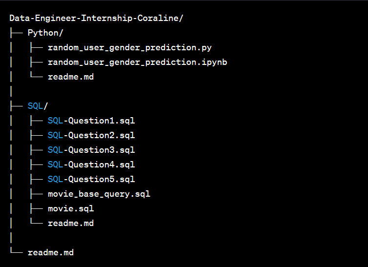
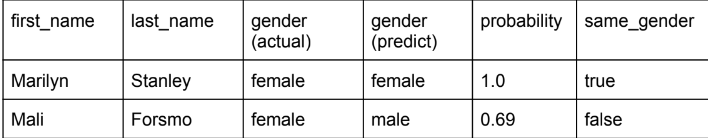
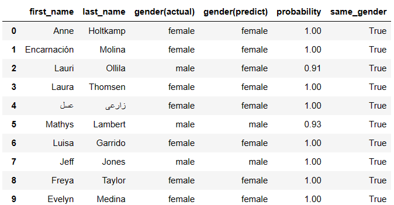

# Coraline-internship-DE

For submit Coraline internship assignment ( Data Engineer )

## Project Structure

1. **Python folder**

   - _random_user_gender_prediction.py_ คือ python script แบบ .py
   - _random_user_gender_prediction.ipynb_ คือ python notebook
   - readme.md คือ document สำหรับอธิบายขั้นตอนในการรัน script รวมถึงวิธีการออกแบบ script และอธิบายฟังก์ชันต่าง ๆ ภายในโปรแกรม

2. **SQL folder**

   - _SQL-Question_ คือไฟล์ SQL script ซึ่งตัวเลขหลัง Question จะเป็นเลขข้อ
   - _movie_base_query.sql_ คือไฟล์สำหรับสร้าง view ที่ใช้ในการ query
   - _movie.sql_ คือ script ที่ใช้ในการสร้าง movie database ขึ้นมา
   - readme.md คือ document สำหรับอธิบายวิธีการรัน script รวมไปถึงคำอธิบายวิธีคิดนแต่ละข้อ

3. **readme.md** คือ document เกี่ยวกับโปรเจคในภาพรวม

นอกจากนี้ยังมี **image folder** ที่เอาไว้ใช้สำหรับเก็บรูปภาพที่ใช้ในไฟล์ readme ต่าง ๆ

## Requirement completeness

### SQL

ในส่วนของ SQL นั้นทาง Coraline ไม่ได้มีผลลัพธ์ที่ถูกต้องให้ดูเป็นตัวอย่างดังนั้นจึงบอกไม่ได้ว่าผลลัพธ์นั้น completeness หรือไม่

### Python

นำผลลัพธ์ที่ได้จาก DataFrame ที่ได้จาก script มาเทียบกับ DataFrame ที่กำหนดมาใน assignment

- DataFrame ที่ assignment ต้องการ
  
  
  
- DataFrame ที่มาจาก script (ตัดมาแค่บางส่วนเพื่่อดูโครงสร้างของ DataFrame)

  

DataFrame ที่ได้มีโครงสร้างเหมือนกัน และสามารถทำงานได้อย่างถูกต้อง 

## What I've learned

- เรียนรู้เกี่ยวกับโครงสร้างของ database ที่ได้มา ทำความเข้าใจ และดูความสัมพันธ์ของ table และ attribute ต่าง ๆ
- ศึกษาการออกแบบ project sturcture เพื่อให้สามารถทำความเข้าใจ และ maintenance โดย engineer คนอื่นได้ง่าย
- เรียนรู้การใช้ และอ่าน Regex(regular expression) เพื่อใช้ในการ match pattern ต่าง ๆ
- การ analyze trade off ของแต่ละวิธีในการแก้ปัญหา เพื่อหาวิธีที่เหมาะสมที่สุด
